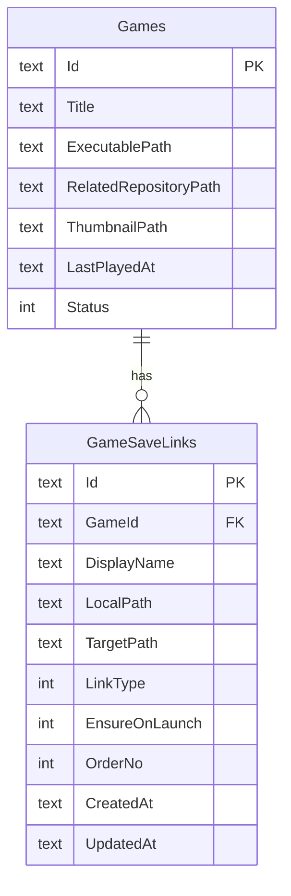
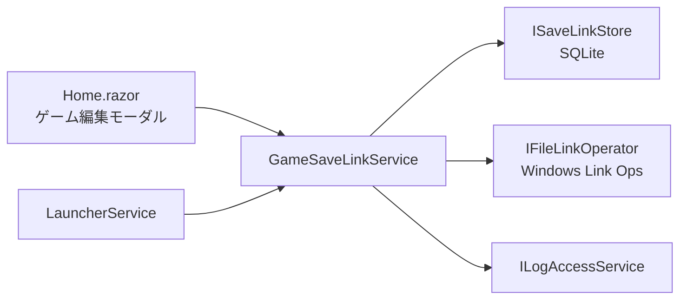
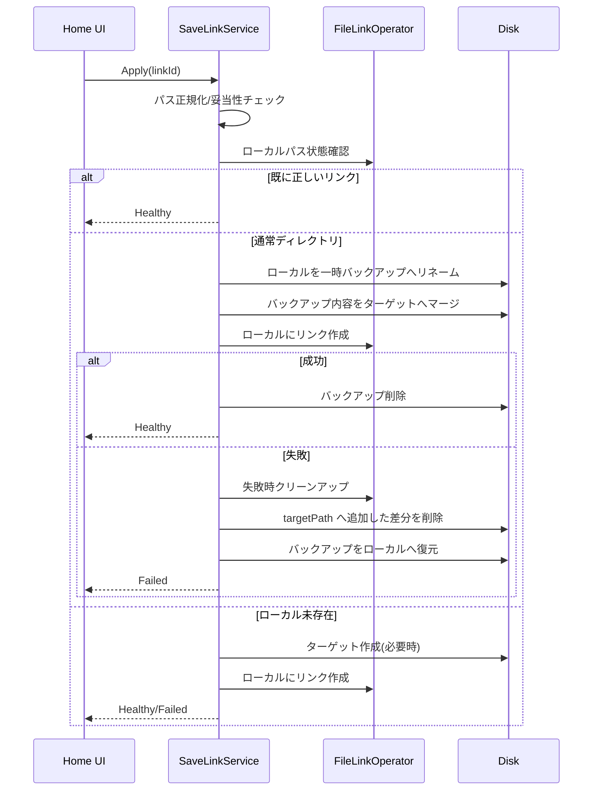
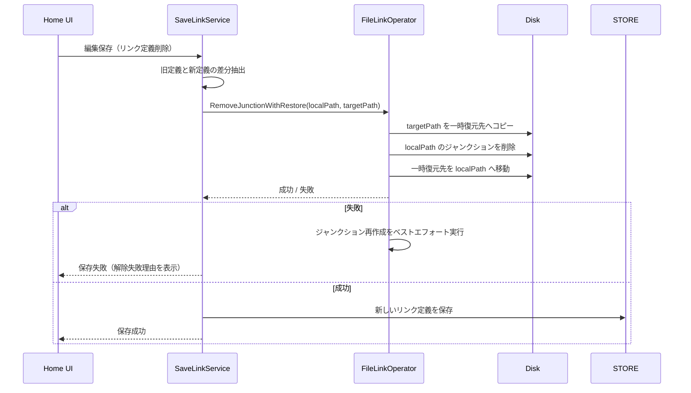

# ゲーム別セーブリンク管理設計

更新日: 2026-02-23
対象: `src/GameLauncherWithGit`（Windows 11 / .NET 9 / MAUI Blazor Hybrid）
状態: Draft（実装前）

## 1. 目的
- ゲームごとにセーブデータ保存先のリンク設定を管理し、ローカル保存パスを OneDrive 配下へ切り替えられるようにする。
- 1ゲームで複数のセーブフォルダを持つケース（例: `SaveData` と `Profiles`）を扱えるようにする。
- 既存セーブデータを破損させない、安全なリンク作成・再適用・検証フローを提供する。

## 2. 背景
- 現行実装は `GameCardItem.RelatedRepositoryPath` の単一リポジトリ管理が中心で、セーブ保存先のリンク管理機能は持っていない。
- セーブデータ容量が大きいゲームでは Git 管理に不向きなため、OneDrive 同期へ切り替える運用ニーズがある。
- ゲームによってセーブ保存先が複数ディレクトリに分かれ、単一パス前提では運用しづらい。

## 3. スコープ

### 3.1 In Scope（MVP）
- ゲームごとの「セーブリンク定義（複数）」の CRUD。
- 各リンク定義に対する手動適用（リンク作成）と状態検証。
- リンク定義削除時のリンク解除（通常フォルダ復元）。
- 既存ローカルフォルダを OneDrive へ移行してリンク化する安全フロー。
- 起動前チェックでリンク不整合を検知し、必要に応じて起動をブロックする導線。

### 3.2 Out of Scope（MVP外）
- OneDrive API 連携（クラウド状態の詳細取得、競合解決UI）。
- ネットワーク越し UNC パス向けの特殊最適化。
- ファイル単位リンク（ハードリンク）管理。

## 4. 用語
- ローカルパス: ゲームが実際に参照するセーブフォルダパス。
- ターゲットパス: 実データを保持する保存先（例: OneDrive 配下）。
- セーブリンク: 「ローカルパス -> ターゲットパス」のリンク定義。
- 適用: ローカルパスにリンクを作成し、必要なら既存データを移行する処理。

## 5. データモデル

### 5.1 モデル案
- `GameSaveLinkItem`
  - `Id: string`
  - `GameId: string`
  - `DisplayName: string?`
  - `LocalPath: string`（ゲーム側参照先）
  - `TargetPath: string`（OneDrive 等の実体保存先）
  - `LinkType: SaveLinkType`（`DirectorySymbolicLink` / `DirectoryJunction`）
  - `EnsureOnLaunch: bool`（起動前に検証対象とするか）
  - `OrderNo: int`（UI並び順）
- `SaveLinkStatus`
  - `Healthy`
  - `NotApplied`
  - `Broken`
  - `Conflict`
  - `PermissionDenied`
  - `InvalidPath`

## 6. コンポーネント設計

### 6.1 追加インターフェース（案）
- `ISaveLinkService`
  - `GetByGameIdAsync(gameId)`
  - `UpsertAsync(gameId, input)`
  - `DeleteAsync(gameId, linkId)`
  - `GetStatusesAsync(gameId)`
  - `ApplyAsync(gameId, linkId)`
  - `ApplyAllAsync(gameId)`
- `ISaveLinkStore`
  - SQLite 永続化（`GameSaveLinks`）
- `IFileLinkOperator`
  - `CreateDirectorySymbolicLink(localPath, targetPath)`
  - `CreateDirectoryJunction(localPath, targetPath)`
  - `DeleteLink(localPath)`
  - `ResolveLinkTarget(localPath)`
  - `RemoveJunctionWithRestore(localPath, targetPath)`

## 7. リンク作成方針（Windows）
- 本機能は `DirectoryJunction` のみを扱う。
- 理由: フォルダ単位管理が前提であり、権限要件を低くして運用時の失敗率を下げるため。
- 既存リンクが想定外ターゲットを指している場合は自動上書きせず、競合として扱う。

## 8. 適用フロー（データ移行付き）

- 既存データ移行時に同名ファイル競合がある場合は **停止** し、既存ローカルフォルダへロールバックする。
- 既存データ移行が途中失敗した場合は、`targetPath` 側に今回追加したファイル/ディレクトリ差分を削除して再試行可能な状態へ戻す。
- ジャンクション作成まで成功した後のバックアップ削除失敗は警告扱いとし、変換結果（リンク適用）は維持する。
- 入力パスは相対パスを許可せず、`LocalPath` / `TargetPath` ともに絶対パス（fully qualified）を必須とする。
- 入力制約として、`LocalPath` と `TargetPath` は同一パスに加えて **親子関係（祖先/子孫）も禁止** する。
  - 例: `LocalPath=C:\\Games\\Foo\\Save` と `TargetPath=C:\\Games\\Foo\\Save\\OneDriveMirror` は不可。
- 複数リンク間でも、他リンクの `LocalPath` / `TargetPath` との一致および親子関係を禁止する。
  - 例: `A->B` と `B->A`、または他リンク `TargetPath` 配下を `LocalPath` にする構成は不可。

### 8.1 ゲーム新規作成時の保存整合性
- 新規作成時は `Games` 登録後に `GameSaveLinks` 保存を実行する。
- `GameSaveLinks` 保存に失敗した場合は、直前に作成したゲームを補償削除して全体を失敗扱いにする。
- 補償削除まで失敗した場合は、手動復旧が必要な状態として明示的にエラーを返す。
- 編集保存時は `Games` 更新と `GameSaveLinks` 置換を同一トランザクションで実行し、部分適用を防止する。
- 編集保存時はセーブリンク検証をサムネイル生成より先に実施し、検証失敗時の不要サムネイル生成を防止する。

### 8.2 リンク解除フロー（ローカル通常フォルダ復元）

- 解除時は `TargetPath` 側データを削除せず保持する（コピー復元）。
- `LocalPath` が通常フォルダの場合は「解除済み」として成功扱いにする。
- `LocalPath` が別ターゲットへのリンクを指している場合は安全のため失敗扱いにする。
- 解除対象のいずれかが失敗した場合は編集保存を中断し、リンク定義を更新しない。

## 9. UI 設計（Home.razor 拡張）
- ゲーム編集モーダルに `セーブリンク（複数）` セクションを追加。
- 一覧行ごとに表示:
  - 表示名
  - ローカルパス
  - ターゲットパス
  - リンク方式
  - 現在ステータス
- 操作:
  - `追加`
  - `編集`
  - `削除`
  - `適用`
- セクション全体操作:
  - `全リンク適用`
  - `OneDrive候補を開く`（環境変数ベースで初期ディレクトリを提示）
- 編集保存時は、セーブリンク入力を先行検証し、検証失敗時はゲーム本体（タイトル/実行ファイルなど）を更新しない。

## 10. 起動前チェック連携
- `LauncherService.LaunchAsync` の起動前処理に「リンク状態チェック」を挿入する。
- `EnsureOnLaunch=true` のリンクに対して、以下を順に実行する:
  1. ジャンクション健全性確認（必要時は作成/再適用）
  2. ターゲット配下の全ファイル読了（OneDrive 実体化）
- 上記で 1 件でも失敗した場合は起動をブロックし、対象リンクと理由を表示する。
- 運用前提として、別端末での同時起動は原則行わない。

## 11. 既存機能との整合
- `RelatedRepositoryPath`（Git同期）とは独立した機能として追加する。
- 既存の監視同期/トレイ/通知はそのまま維持し、リンク適用失敗は通知履歴とログへ記録する。
- SQLite は `Games` テーブル互換を維持し、`GameSaveLinks` を新設する。
- セーブリンク取得に失敗したゲームは「未設定」扱いにせず、編集保存をブロックして設定消失を防ぐ。
- ゲーム削除時の `GameSaveLinks` / `Games` 削除は同一トランザクションで実行し、部分削除を防ぐ。

## 12. テスト観点
- 正常系:
  - 複数リンク登録・保存・再読込。
  - ローカル未存在状態でのリンク作成。
  - ローカル既存データ移行後のリンク作成。
- 異常系:
  - 権限不足（シンボリックリンク作成失敗）。
  - ローカルが別ターゲットへの既存リンク。
  - ターゲット側のファイルロック競合。
  - パス不正（相対、空文字、同一パス）。
- 回帰:
  - 既存ゲーム登録/編集/削除。
  - 既存Git同期と起動前同期。

## 13. 未確定事項（実装判断待ち）
1. 解除機能は MVP に含める。
   - 方針: リンク定義削除時に `TargetPath` のデータを `LocalPath` へコピー復元して通常フォルダ化する。
