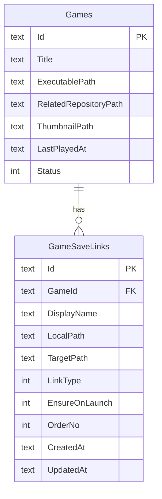
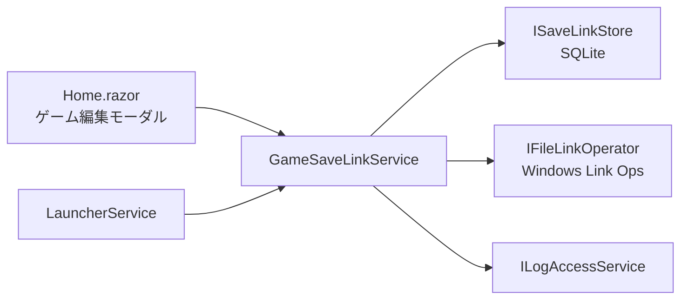
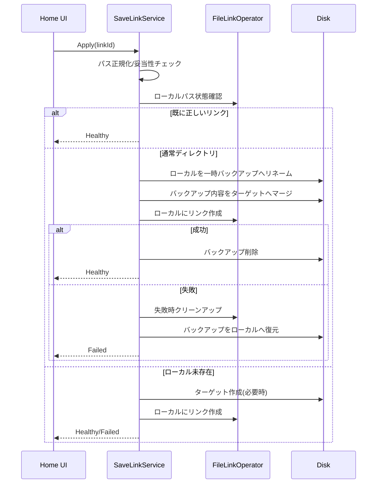

# ゲーム別セーブリンク管理設計

更新日: 2026-02-21
対象: `src/GameLauncherWithGit`（Windows 11 / .NET 9 / MAUI Blazor Hybrid）
状態: Draft（実装前）

## 1. 目的
- ゲームごとにセーブデータ保存先のリンク設定を管理し、ローカル保存パスを OneDrive 配下へ切り替えられるようにする。
- 1ゲームで複数のセーブフォルダを持つケース（例: `SaveData` と `Profiles`）を扱えるようにする。
- 既存セーブデータを破損させない、安全なリンク作成・再適用・検証フローを提供する。

## 2. 背景
- 現行実装は `GameCardItem.RelatedRepositoryPath` の単一リポジトリ管理が中心で、セーブ保存先のリンク管理機能は持っていない。
- セーブデータ容量が大きいゲームでは Git 管理に不向きなため、OneDrive 同期へ切り替える運用ニーズがある。
- ゲームによってセーブ保存先が複数ディレクトリに分かれ、単一パス前提では運用しづらい。

## 3. スコープ

### 3.1 In Scope（MVP）
- ゲームごとの「セーブリンク定義（複数）」の CRUD。
- 各リンク定義に対する手動適用（リンク作成）と状態検証。
- 既存ローカルフォルダを OneDrive へ移行してリンク化する安全フロー。
- 起動前チェックでリンク不整合を検知し、必要に応じて起動をブロックする導線。

### 3.2 Out of Scope（MVP外）
- OneDrive API 連携（クラウド状態の詳細取得、競合解決UI）。
- ネットワーク越し UNC パス向けの特殊最適化。
- ファイル単位リンク（ハードリンク）管理。

## 4. 用語
- ローカルパス: ゲームが実際に参照するセーブフォルダパス。
- ターゲットパス: 実データを保持する保存先（例: OneDrive 配下）。
- セーブリンク: 「ローカルパス -> ターゲットパス」のリンク定義。
- 適用: ローカルパスにリンクを作成し、必要なら既存データを移行する処理。

## 5. データモデル

### 5.1 モデル案
- `GameSaveLinkItem`
  - `Id: string`
  - `GameId: string`
  - `DisplayName: string?`
  - `LocalPath: string`（ゲーム側参照先）
  - `TargetPath: string`（OneDrive 等の実体保存先）
  - `LinkType: SaveLinkType`（`DirectorySymbolicLink` / `DirectoryJunction`）
  - `EnsureOnLaunch: bool`（起動前に検証対象とするか）
  - `OrderNo: int`（UI並び順）
- `SaveLinkStatus`
  - `Healthy`
  - `NotApplied`
  - `Broken`
  - `Conflict`
  - `PermissionDenied`
  - `InvalidPath`

## 6. コンポーネント設計

### 6.1 追加インターフェース（案）
- `ISaveLinkService`
  - `GetByGameIdAsync(gameId)`
  - `UpsertAsync(gameId, input)`
  - `DeleteAsync(gameId, linkId)`
  - `GetStatusesAsync(gameId)`
  - `ApplyAsync(gameId, linkId)`
  - `ApplyAllAsync(gameId)`
- `ISaveLinkStore`
  - SQLite 永続化（`GameSaveLinks`）
- `IFileLinkOperator`
  - `CreateDirectorySymbolicLink(localPath, targetPath)`
  - `CreateDirectoryJunction(localPath, targetPath)`
  - `DeleteLink(localPath)`
  - `ResolveLinkTarget(localPath)`

## 7. リンク作成方針（Windows）
- 本機能は `DirectoryJunction` のみを扱う。
- 理由: フォルダ単位管理が前提であり、権限要件を低くして運用時の失敗率を下げるため。
- 既存リンクが想定外ターゲットを指している場合は自動上書きせず、競合として扱う。

## 8. 適用フロー（データ移行付き）

- 既存データ移行時に同名ファイル競合がある場合は **停止** し、既存ローカルフォルダへロールバックする。

## 9. UI 設計（Home.razor 拡張）
- ゲーム編集モーダルに `セーブリンク（複数）` セクションを追加。
- 一覧行ごとに表示:
  - 表示名
  - ローカルパス
  - ターゲットパス
  - リンク方式
  - 現在ステータス
- 操作:
  - `追加`
  - `編集`
  - `削除`
  - `適用`
- セクション全体操作:
  - `全リンク適用`
  - `OneDrive候補を開く`（環境変数ベースで初期ディレクトリを提示）

## 10. 起動前チェック連携
- `LauncherService.LaunchAsync` の起動前処理に「リンク状態チェック」を挿入する。
- `EnsureOnLaunch=true` のリンクに対して、以下を順に実行する:
  1. ジャンクション健全性確認（必要時は作成/再適用）
  2. ターゲット配下の全ファイル読了（OneDrive 実体化）
- 上記で 1 件でも失敗した場合は起動をブロックし、対象リンクと理由を表示する。
- 運用前提として、別端末での同時起動は原則行わない。

## 11. 既存機能との整合
- `RelatedRepositoryPath`（Git同期）とは独立した機能として追加する。
- 既存の監視同期/トレイ/通知はそのまま維持し、リンク適用失敗は通知履歴とログへ記録する。
- SQLite は `Games` テーブル互換を維持し、`GameSaveLinks` を新設する。

## 12. テスト観点
- 正常系:
  - 複数リンク登録・保存・再読込。
  - ローカル未存在状態でのリンク作成。
  - ローカル既存データ移行後のリンク作成。
- 異常系:
  - 権限不足（シンボリックリンク作成失敗）。
  - ローカルが別ターゲットへの既存リンク。
  - ターゲット側のファイルロック競合。
  - パス不正（相対、空文字、同一パス）。
- 回帰:
  - 既存ゲーム登録/編集/削除。
  - 既存Git同期と起動前同期。

## 13. 未確定事項（実装判断待ち）
1. 解除機能（リンク解除して通常フォルダへ戻す）を MVP に含めるか。
