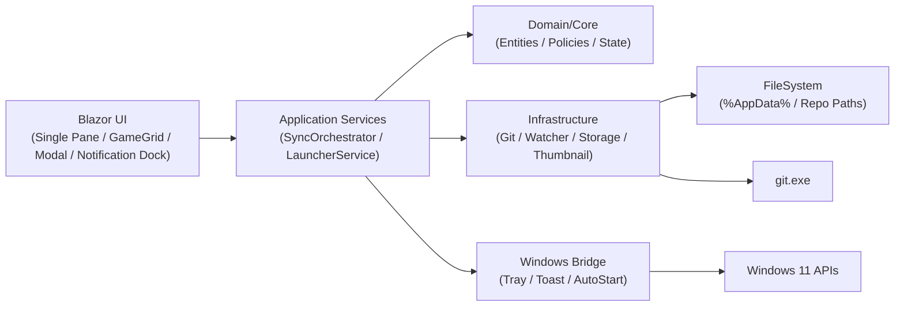
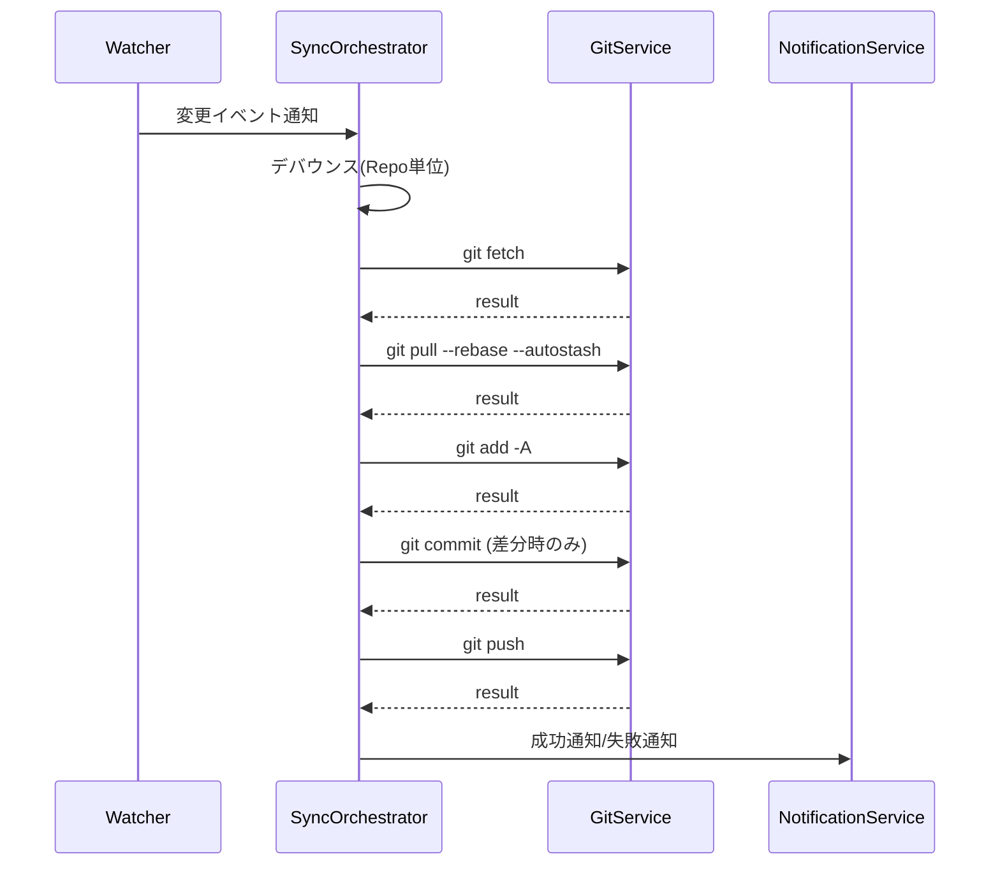
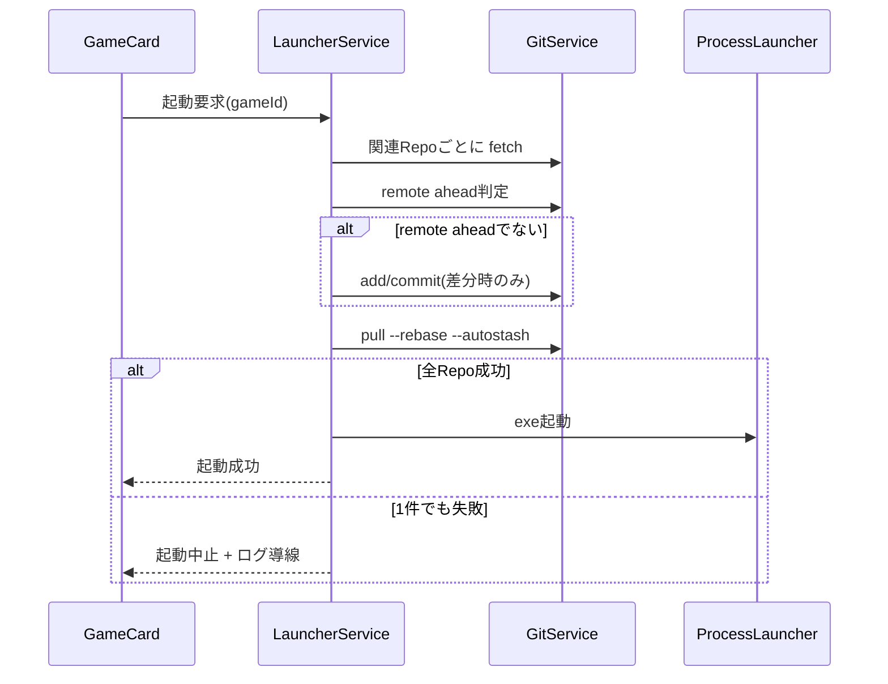

# MAUI Blazor アーキテクチャ設計（MVP）

更新日: 2026-02-06
対象: Windows 11 / .NET 9 / .NET MAUI Blazor Hybrid
関連: `docs/design/resume-roadmap.md`（中断後の再開用メモ）

## 1. 目的
- `docs/要件定義.md` のMVP要件を、MAUI Blazor Hybrid で実装可能な構成に落とし込む。
- UI（Blazor）と Windows 固有機能（タスクトレイ、Toast、自動起動）を疎結合に分離する。

## 2. 設計方針
- UI は Razor コンポーネントで実装し、状態更新はアプリケーションサービス経由で行う。
- Git 操作・監視・通知はインターフェース化し、テスト時に差し替え可能にする。
- Windows 固有機能は `Platforms/Windows` 側で実装し、共通層からは抽象インターフェースのみ参照する。
- 同期制御は「リポジトリ単位の単一実行 + デバウンス + 再実行フラグ」で競合を回避する。

## 3. 全体構成

## 4. コンポーネント責務
- `UI (Blazor)`
  - 単一ペインレイアウトでゲームカード表示、詳細モーダル、操作コマンド発行
  - ViewModel へのバインドと状態表示（待機/同期中/エラー）
  - 画面右下固定の通知領域で、操作結果とエラーを表示
- `SyncOrchestrator`
  - 監視イベント受信、デバウンス管理、同期ジョブ実行順序制御
  - 失敗分類とリトライポリシー適用
- `LauncherService`
  - ゲーム起動前に `fetch` を実行し、リモート先行でなければ `add -A -> commit(差分時のみ)` を実行
  - その後 `pull --rebase --autostash` を実行
  - 失敗時の起動ブロックとログ導線制御
- `GitService`
  - Git コマンド実行と結果収集（exit code / stdout / stderr）
- `RepositoryWatcherService`
  - FileSystemWatcher で変更イベントを集約して通知
- `NotificationService`
  - Windows通知（`AppNotificationManager`）の発火と重複通知抑制
  - 通知API失敗時はログ出力へフォールバック
- `TrayService`
  - Win32トレイアイコン（`Shell_NotifyIcon`）で同期状態を表示（待機/同期中/エラー停止）
  - エラー停止時はトレイバルーンで注意喚起
- `ThumbnailService`
  - 画像を長辺 512px の PNG に変換して `%AppData%/thumbnails` に保存
- `PathPickerService`
  - 実行ファイル、サムネイル画像、関連リポジトリフォルダの選択をOSピッカー経由で提供
  - UI層から Windows API へ直接依存しないための抽象境界を維持
- `LogAccessService`
  - `%AppData%/logs/app-errors.log` へエラーメッセージを記録
  - 最新エラーログ/ログフォルダをOSシェルで開く
- `GameLibraryStore (SQLite)`
  - ゲーム設定（タイトル/実行ファイル/関連リポジトリ/サムネイルパス/状態）をSQLiteへ保存・読込

## 5. 同期フロー

## 6. 起動ランチャーフロー

## 7. 状態モデル
- リポジトリ同期状態
  - `Idle`: 待機
  - `Debouncing`: 変更待機
  - `Syncing`: 同期実行中
  - `ErrorPaused`: 競合などで自動同期停止
- ゲームカード状態
  - `Unknown`, `Syncing`, `Synced`, `Error`
- ゲーム設定モデル
  - `ExecutablePath`: 実行ファイルパス（必須）
  - `ThumbnailPath`: 生成済みサムネイル画像パス（任意）
  - `RelatedRepositoryPath`: 関連リポジトリフォルダ（任意、単一）

## 8. DI ライフサイクル（MVP）
| サービス | ライフサイクル | 理由 |
|---|---|---|
| SyncOrchestrator | Singleton | 監視と同期キューを全体で一元管理するため |
| RepositoryWatcherService | Singleton | FileSystemWatcher を重複生成しないため |
| RepositoryStateStore | Singleton | リポジトリ状態共有のため |
| NotificationService | Singleton | 通知抑制状態を共有するため |
| TrayService | Singleton | アプリ全体でトレイを単一管理するため |
| AutoStartService | Singleton | Windows Runキーの自動起動設定を集約するため |
| LogAccessService | Singleton | ログ記録とログ表示導線を共有するため |
| GitService | Transient | コマンド実行を独立単位で扱うため |
| ThumbnailService | Scoped | UI操作単位で生成しやすくするため |
| LauncherService | Scoped | 画面操作からの起動処理単位で扱うため |

## 9. 永続化
- 保存先: `%AppData%/GameLauncherWithGit/`
- 保存対象
  - `game-library.db`: ゲーム設定（タイトル、実行ファイル、関連リポジトリ、サムネイルパス、状態、最終プレイ日時）
  - `settings.json`: リポジトリ設定、デバウンス秒数（予定）
  - `logs/*.log`: Git 実行ログ、障害ログ
  - `thumbnails/*.png`: 変換済みサムネイル

## 10. エラーハンドリング方針
- 競合（rebase conflict）
  - 対象リポジトリを `ErrorPaused` に遷移し自動同期停止
  - Toast + トレイ + ログで通知
- オフライン/リモート不達
  - ローカル commit 継続、push は指数バックオフ再試行
  - 初回失敗と復旧時のみ通知（連続失敗は通知抑制）
- 認証/権限エラー
  - ガイド付きメッセージ（再ログイン、権限確認）を表示

## 11. テスト観点
- 同期: デバウンス、単一実行制御、同期順序、再実行フラグ
- ランチャー: 起動前 pull 成功時のみ起動、失敗時ブロック
- Windows連携: トレイ状態遷移、Toast 発火、自動起動設定
- サムネイル: 512px変換、PNG化、失敗時フォールバック

## 12. 実装ステータス（2026-02-06）
- 実装済み
  - MAUI Blazor Hybrid の初期スキャフォールド（`GameLauncherWithGit.sln` / `src/GameLauncherWithGit`）
  - `Domain` / `Application` / `Infrastructure` の基本フォルダとインターフェース
  - `GameLibraryStore` による SQLite 永続化（`game-library.db`）
  - DI 登録の初期実装
  - `GitService` の実装（`git` プロセス実行、stdout/stderr/exit code 取得）
  - `LauncherService` の実装（起動前 `fetch -> remote ahead判定 -> (必要時のみ)add/commit -> pull --rebase --autostash`、失敗時の起動ブロック）
  - ゲーム一覧カードUI（先頭の「+ 新規追加」カード、`▶ 起動`、`設定`、起動結果表示）
  - サイドバーを廃止し、`MainLayout` を1画面向けの単一ペイン構成に変更
  - ホーム画面のダークテーマ化（カード/モーダル/ボタン配色更新）
  - 通知/エラー表示を右下固定の通知ドックへ集約
  - ホーム画面に「環境設定」導線を追加（自動起動トグル、最新エラーログ/ログフォルダを開く）
  - ゲーム登録/編集モーダル（タイトル/実行ファイル/関連リポジトリ）
  - ゲーム登録/編集モーダルのサムネイル画像選択（参照/解除）
  - `ThumbnailService` の実装（長辺512px・PNG変換、`%AppData%/thumbnails` 保存）
  - サムネイル登録済みカードの表示モード切替（文字情報非表示、画像+操作ボタンのみ表示）
  - パス選択UI（実行ファイル参照、関連リポジトリフォルダ追加）
  - 単一リポジトリ選択UI（フォルダ選択/解除、手入力なし）
  - ゲーム登録/更新時の関連リポジトリ検証（`git rev-parse --is-inside-work-tree`）
  - アプリ起動時の Git 利用可否チェック（`git --version`）。未導入/起動不可時は Home でエラー表示し、ランチャーUIを非表示
  - RepositoryWatcherService の FileSystemWatcher 実装（登録/解除、変更イベント通知）
  - SyncOrchestrator の監視イベント購読、10秒デバウンス、リポジトリ単位の単一実行制御
  - SyncOrchestrator の同期本体（`fetch -> pull --rebase --autostash -> add -A -> status -> commit(差分時のみ) -> push`）
  - pull/rebase 競合時の `ErrorPaused` 遷移、それ以外の同期失敗時の `Idle` 復帰
  - 監視キーのリポジトリパス統一（同一リポジトリ重複監視の抑止）
  - Home 初期化時/保存後の監視対象再構成（関連リポジトリごとに監視登録）
  - Home で `ErrorPaused` を検知したゲームカードに「再開」ボタンを表示し、手動で即時同期再開可能
  - NotificationService のWindows通知実装（重複抑制・失敗時フォールバック）
  - TrayService のトレイ状態表示実装（Win32 `Shell_NotifyIcon`）
  - SyncOrchestrator から通知/トレイ更新を連携（失敗通知と状態反映）
  - Windows 実行/配布スクリプト（`scripts/run-local-unpackaged.ps1` / `scripts/publish-windows-msix.ps1`）
- 未実装
  - 同期失敗時の指数バックオフ再試行と通知抑制
  - 設定永続化（`settings.json`）とログ画面/運用導線

## 13. Windows 配布モデル（Unpackaged / MSIX）
- 開発時（ローカル実行）は Unpackaged を採用する。
  - `WindowsPackageType=None`
  - コマンド: `pwsh -File scripts/run-local-unpackaged.ps1`
- 配布時のみ MSIX を採用する。
  - コマンド: `pwsh -File scripts/publish-windows-msix.ps1`
- 「ローカルでアプリがインストールされる」主因は、MSIX 発行/実行経路を使っていること。
  - `dotnet publish` で `WindowsPackageType=MSIX` を使った場合
  - Visual Studio 側でパッケージ配布用プロファイルを利用した場合

詳細手順は `docs/design/windows-msix-keyvault-signing.md` を参照。
