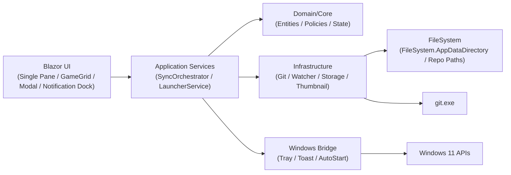
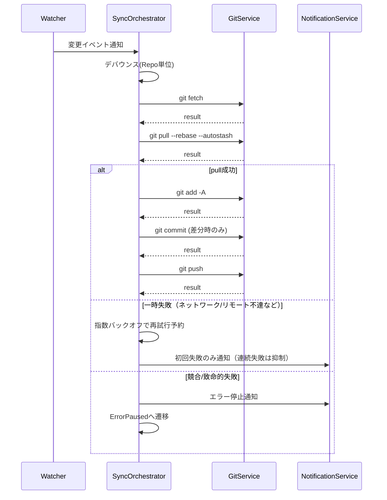
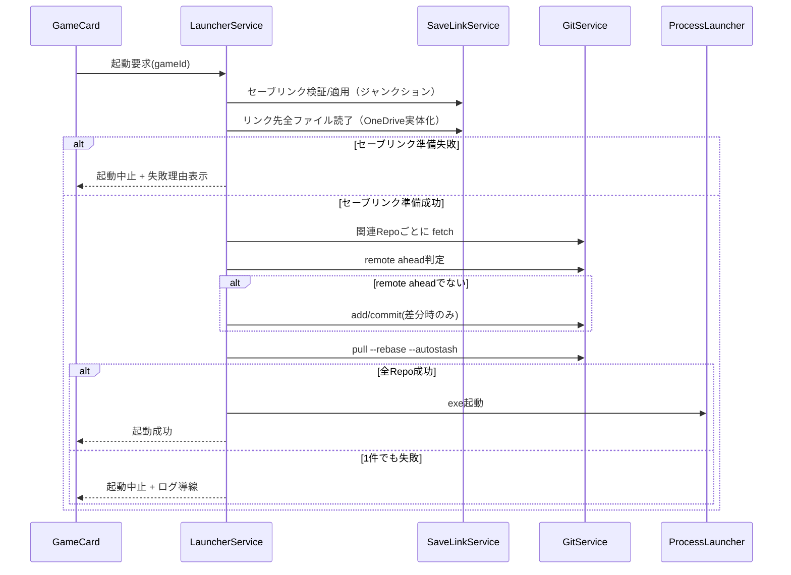

# MAUI Blazor アーキテクチャ設計（MVP）

更新日: 2026-02-24
対象: Windows 11 / .NET 9 / .NET MAUI Blazor Hybrid
関連: `docs/design/resume-roadmap.md`（中断後の再開用メモ）

## 1. 目的
- `docs/要件定義.md` のMVP要件を、MAUI Blazor Hybrid で実装可能な構成に落とし込む。
- UI（Blazor）と Windows 固有機能（タスクトレイ、Toast、自動起動）を疎結合に分離する。

## 2. 設計方針
- UI は Razor コンポーネントで実装し、状態更新はアプリケーションサービス経由で行う。
- Git 操作・監視・通知はインターフェース化し、テスト時に差し替え可能にする。
- Windows 固有機能は `Platforms/Windows` 側で実装し、共通層からは抽象インターフェースのみ参照する。
- 同期制御は「リポジトリ単位の単一実行 + デバウンス + 再実行フラグ」で競合を回避する。

## 3. 全体構成

## 4. コンポーネント責務
- `UI (Blazor)`
  - 単一ペインレイアウトでゲームカード表示、詳細モーダル、操作コマンド発行
  - ViewModel へのバインドと状態表示（待機/同期中/エラー）
  - 画面右下固定の通知領域で、操作結果とエラーを表示
  - 遅延が入り得るユーザー起点の `async` 操作では、全画面ローディングオーバーレイと処理中メッセージを表示する（定期ポーリング等のバックグラウンド更新は対象外）
  - 環境設定モーダルに通知センター（時系列履歴、全件コピー、履歴クリア、成功/失敗フィルタ）を提供
  - Home ユーティリティバーに `Help` ボタンを配置し、アプリ全体の取扱説明モーダルを表示
  - Home ユーティリティバーの検索入力でゲームタイトルを即時絞り込み
  - Home ユーティリティバーに「Gitステータス更新」ボタンを追加し、手動でGit状態を再取得
  - カード上のピン留めトグルで表示優先順を即時更新
  - Home の `+` / `-` でゲームカード表示サイズを即時変更し、設定へ反映
  - 環境設定でカード表示項目（タイトル/同期ステータス）を切り替え、サムネイルカード高さへ反映
  - ゲームカードの枠/背景色で Git 状態（clean/dirty/ahead/behind/diverged/error）を可視化
  - Git 状態の自動更新は `SyncDebounceSeconds` と同じ秒数でポーリング実行
  - カード上で関連リポジトリの同期履歴タイムライン（直近3件）を表示
  - ゲーム登録/編集は実行ファイル未設定でも保存可能とし、未設定ゲームの起動ボタンは無効化する
  - カード上の削除操作で確認モーダルを表示し、削除完了後に一覧と監視状態を更新
  - 環境設定モーダルにログビューア（件数/レベル/キーワードフィルタ、更新、コピー）を提供
  - ログビューアは `repo/command/exitCode` を行内表示し、`detail/stdout/stderr` を折りたたみ表示する
- `SyncOrchestrator`
  - 監視イベント受信、デバウンス管理、同期ジョブ実行順序制御
  - 失敗分類とリトライポリシー適用（指数バックオフ再試行、通知抑制、復旧通知）
  - pull は追跡設定（`branch.<name>.remote` / `branch.<name>.merge`）の有効値（`git config --get`）から明示的に組み立て、remote/branch 引数をエスケープして実行する
  - push は `git push` 既定解決（`branch.<name>.pushRemote` / `remote.pushDefault` 等）を利用して宛先を決定する
  - `branch/config` 取得の「キー未設定（exit=1 かつ出力空）」時は upstream 未設定として pull をスキップし、push は `git push` 既定解決で実行する（それ以外の取得失敗は同期エラー）
  - 同期結果（成功/失敗/停止）をリポジトリ単位の履歴ストアへ記録
- `LauncherService`
  - 起動前にセーブリンク（ジャンクション）を検証し、リンク先配下の全ファイルを読了して OneDrive 実体化を待つ
  - セーブリンク準備が1件でも失敗した場合はゲーム起動をブロックする
  - ゲーム起動前に `fetch` を実行し、リモート先行でなければ `add -A -> commit(差分時のみ)` を実行
  - その後 `pull --rebase --autostash <remote> <branch>` を実行（追跡設定がない場合は pull をスキップ）
  - unborn branch（初回コミット前）や upstream 未設定は専用判定で分離し、追跡情報取得コマンド自体の失敗は同期失敗として扱う
  - 失敗時の起動ブロックとログ導線制御
- `GitService`
  - Git コマンド実行と結果収集（exit code / stdout / stderr）
- `RepositoryWatcherService`
  - FileSystemWatcher で変更イベントを集約して通知
- `NotificationService`
  - Windows通知（`AppNotificationManager`）の発火と重複通知抑制
  - 通知API失敗時はログ出力へフォールバック
- `TrayService`
  - Win32トレイアイコン（`Shell_NotifyIcon`）で同期状態を表示（待機/同期中/エラー停止）
  - `Resources/TrayIcon/*.ico`（待機/同期中/エラー停止）を読み込み、状態に応じて切替表示する
  - アイコン読み込みに失敗した場合はシステム既定アイコンへフォールバックする
  - エラー停止時はトレイバルーンで注意喚起
  - 右クリックメニュー（今すぐ同期 / 設定 / ログを開く / 終了）を提供
  - `WM_CLOSE` 捕捉により「閉じる=非表示、終了=明示操作のみ」を実現
- `App (Single Instance)`
  - Windowsでは名前付き `Mutex` で単一インスタンスを保証する
  - 多重起動時は新規プロセスを終了し、既存インスタンスのトップレベルウィンドウを `ShowWindow(SW_RESTORE)` + `SetForegroundWindow` で前面復帰する
- `ThumbnailService`
  - 画像を長辺 512px の PNG に変換して `FileSystem.AppDataDirectory/thumbnails` に保存
- `PathPickerService`
  - 実行ファイル、サムネイル画像、関連リポジトリフォルダ、任意フォルダ（セーブリンク用）の選択をOSピッカー経由で提供
  - UI層から Windows API へ直接依存しないための抽象境界を維持
- `GameLibraryService`
  - ゲーム登録/更新/削除のアプリケーション操作を提供
  - 削除時に `thumbnails` 配下の管理対象サムネイルをクリーンアップ
- `SaveLinkService`
  - ゲームごとのセーブリンク定義（複数）を保存/取得する
  - 起動前にリンクごとのジャンクション適用とリンク先読了処理を実行する
- `LocalSaveLinkOperator`
  - 既存セーブフォルダを退避してリンク先へ移行し、ジャンクションを作成する
  - リンク先配下の全ファイルを読了し、OneDrive のプレースホルダを実体化する
- `LogAccessService`
  - `MonochromeMemory.Log` を使って `FileSystem.AppDataDirectory/logs/app-events.jsonl` へ構造化エラーログを記録
  - 最新エラーログ/ログフォルダをOSシェルで開く
  - `app-events.jsonl` の直近ログを読み込み、レベル/キーワードで絞り込んでUIへ返す
  - `record.data` / `record.data.keyValues` から `repositoryId` / `command` / `exitCode` / `stdout` / `stderr` を抽出し、未設定時は `repo=` / `command=` / `exitCode=` のテキストをフォールバック解析する
  - 起動時にログメンテナンス（保持日数超過の削除、サイズ超過時ローテーション）を実行
- `AppSettingsService`
  - `FileSystem.AppDataDirectory/settings.json` を読込/保存し、同期/通知/ログ運用/カード表示設定を管理
- `SettingsPanelService`
  - トレイメニューなどUI外部から設定モーダルを開くためのイベントブリッジ
- `GameLibraryStore (SQLite)`
  - ゲーム設定（タイトル/実行ファイル/関連リポジトリ/サムネイルパス/状態/ピン留め）をSQLiteへ保存・読込
  - `GameSaveLinks` テーブルでセーブリンク定義（`LocalPath`、`TargetPath`、`EnsureOnLaunch`、`OrderNo`）を保存・読込
  - 並び順を `IsPinned DESC -> LastPlayedAt DESC -> Title` で返却
- `RepositorySyncHistoryStore (SQLite)`
  - 同期履歴（`RepositoryId`、`Status`、`StartedAt`、`FinishedAt`、`DurationMs`、`Command`、`Reason`）を保存
  - カード表示向けにリポジトリ単位で直近N件を取得

## 5. 同期フロー

## 6. 起動ランチャーフロー

## 7. 状態モデル
- リポジトリ同期状態
  - `Idle`: 待機
  - `Debouncing`: 変更待機
  - `Syncing`: 同期実行中
  - `ErrorPaused`: 競合などで自動同期停止
- ゲームカード状態
  - `Unknown`, `Syncing`, `Synced`, `Error`
- Git 可視化状態（カード枠/背景色）
  - `NotConfigured`, `Unknown`, `Clean`, `Dirty`, `Ahead`, `Behind`, `Diverged`, `Error`
- ゲーム設定モデル
  - `ExecutablePath`: 実行ファイルパス（必須）
  - `ThumbnailPath`: 生成済みサムネイル画像パス（任意）
  - `RelatedRepositoryPath`: 関連リポジトリフォルダ（任意、単一）
- セーブリンク設定モデル（ゲームごと複数）
  - `LocalPath`: ゲーム側セーブフォルダ（ジャンクション作成先）
  - `TargetPath`: 実データ保存先フォルダ（OneDrive 配下を想定）
  - `EnsureOnLaunch`: 起動前チェック対象フラグ

## 8. DI ライフサイクル（MVP）
| サービス | ライフサイクル | 理由 |
|---|---|---|
| SyncOrchestrator | Singleton | 監視と同期キューを全体で一元管理するため |
| RepositoryWatcherService | Singleton | FileSystemWatcher を重複生成しないため |
| RepositoryStateStore | Singleton | リポジトリ状態共有のため |
| NotificationService | Singleton | 通知抑制状態を共有するため |
| TrayService | Singleton | アプリ全体でトレイを単一管理するため |
| AppSettingsService | Singleton | `settings.json` の読込/保存と設定値参照を共有するため |
| SettingsPanelService | Singleton | トレイなど外部導線から設定モーダル表示要求を共有するため |
| AutoStartService | Singleton | Windows Runキーの自動起動設定を集約するため |
| LogAccessService | Singleton | ログ記録とログ表示導線を共有するため |
| LocalSaveLinkOperator | Singleton | ジャンクション作成/リンク先読了を共有するため |
| GitService | Transient | コマンド実行を独立単位で扱うため |
| ThumbnailService | Scoped | UI操作単位で生成しやすくするため |
| LauncherService | Scoped | 画面操作からの起動処理単位で扱うため |
| GameLibraryService | Scoped | 画面操作からのゲーム設定処理単位で扱うため |
| SaveLinkService | Scoped | 画面操作/起動前処理からセーブリンク管理を扱うため |

## 9. 永続化
- 保存先: `FileSystem.AppDataDirectory`
- 保存対象
  - `game-library.db`: ゲーム設定（タイトル、実行ファイル、関連リポジトリ、サムネイルパス、状態、最終プレイ日時）
    - `GameSaveLinks` テーブル: ゲームごとのセーブリンク定義（`LocalPath`、`TargetPath`、`EnsureOnLaunch`、`OrderNo`）
    - `RepositorySyncHistory` テーブル: リポジトリ単位の同期履歴（最新50件/リポジトリ）
  - `settings.json`: 同期/通知/ログ/表示設定（デバウンス秒、再試行初期秒、再試行最大秒、通知抑制秒、ログ保持日数、ログ最大サイズMB、カードサイズ%、カードタイトル表示、カード同期ステータス表示）
  - `logs/app-events.jsonl`: 構造化エラーログ（MonochromeMemory.Log）
  - `logs/app-events-*.jsonl`: ローテーション済みログ
  - `thumbnails/*.png`: 変換済みサムネイル
- 資産
  - `Resources/AppIcon/appicon.svg` + `appiconfg.svg`: アプリ本体アイコン（ゲームパッドモチーフ）
  - `Resources/TrayIcon/tray-idle.ico`: 待機状態トレイアイコン
  - `Resources/TrayIcon/tray-syncing.ico`: 同期中トレイアイコン
  - `Resources/TrayIcon/tray-error.ico`: エラー停止トレイアイコン
- バージョン更新時の更新対象
  - `src/GameLauncherWithGit/GameLauncherWithGit.csproj`
    - `ApplicationDisplayVersion`
    - `ApplicationVersion`
  - `src/GameLauncherWithGit/Platforms/Windows/Package.appxmanifest`
    - `Identity Version`（`X.Y.Z.0` 形式）
  - 運用詳細は `docs/design/windows-msix-keyvault-signing.md` の「7. バージョン更新チェックリスト」を参照

## 10. エラーハンドリング方針
- 競合（rebase conflict）
  - 対象リポジトリを `ErrorPaused` に遷移し自動同期停止
  - Toast + トレイ + ログで通知
- オフライン/リモート不達
  - 同期ジョブを `Idle` に戻し、指数バックオフで自動再試行
  - 初回失敗と復旧時のみ通知（連続失敗は通知抑制）
- 認証/権限エラー
  - ガイド付きメッセージ（再ログイン、権限確認）を表示

## 11. テスト観点
- 同期: デバウンス、単一実行制御、同期順序、再実行フラグ
- ランチャー: 起動前 pull 成功時のみ起動、失敗時ブロック
- セーブリンク: ジャンクション作成、既存フォルダ移行、リンク先全ファイル読了、読了失敗時の起動ブロック
- Windows連携: トレイ状態遷移、Toast 発火、自動起動設定
- サムネイル: 512px変換、PNG化、失敗時フォールバック
- ログビューア: JSONL破損行スキップ、フィルタ結果表示、`repo/command/exitCode` 表示、`detail/stdout/stderr` 折りたたみ、拡張メタデータ込みクリップボードコピー
- 通知センター: 通知追加順（最新優先）、上限200件、全件コピー/履歴クリア、成功/失敗フィルタ、通知ドックとの併用表示
- ログ運用: 保持日数削除、サイズ超過ローテーション
- 表示設定: カードサイズ変更の即時反映と再起動後復元
- 表示設定: タイトル/同期ステータス表示切替の即時反映と再起動後復元、サムネイルカード高さ追従
- 同期履歴: 成功/失敗/停止の記録、カードへの最新履歴表示、所要時間表示
- 削除操作: 確認モーダル、SQLite削除、サムネイル削除、監視再構成
- ゲーム編集: 実行ファイル未設定で保存可能、未設定カードで起動ボタンが無効化されること
- 検索操作: タイトル部分一致の即時絞り込みと0件表示
- ピン操作: ピン留め状態更新とピン優先表示
- Git状態表示: 手動更新ボタンでの再取得、`SyncDebounceSeconds` 間隔ポーリング、状態別のカード色反映
- Help表示: 取扱説明モーダルの表示、Git状態一覧と推奨アクションの参照
- ローディング表示: ユーザー起点の遅延操作（起動/保存/削除/手動更新/コピー/外部オープン等）でオーバーレイ表示、処理完了で解除

## 12. 実装ステータス（2026-02-07）
- 実装済み
  - MAUI Blazor Hybrid の初期スキャフォールド（`GameLauncherWithGit.sln` / `src/GameLauncherWithGit`）
  - `Domain` / `Application` / `Infrastructure` の基本フォルダとインターフェース
  - `GameLibraryStore` による SQLite 永続化（`game-library.db`）
  - DI 登録の初期実装
  - `GitService` の実装（`git` プロセス実行、stdout/stderr/exit code 取得）
  - `LauncherService` の実装（起動前 `fetch -> remote ahead判定 -> (必要時のみ)add/commit -> pull --rebase --autostash`、失敗時の起動ブロック）
  - ゲーム一覧カードUI（先頭の「+ 新規追加」カード、`▶ 起動`、`設定`、起動結果表示）
  - サイドバーを廃止し、`MainLayout` を1画面向けの単一ペイン構成に変更
  - ホーム画面のダークテーマ化（カード/モーダル/ボタン配色更新）
  - 通知/エラー表示を右下固定の通知ドックへ集約
  - 環境設定モーダルに通知センター追加（最新優先履歴、全件コピー、履歴クリア、成功/失敗フィルタ、200件上限）
  - ホーム画面に「環境設定」導線を追加（自動起動トグル、最新エラーログ/ログフォルダを開く）
  - ホーム画面に `Help` 導線を追加（基本操作、カードの見方、Git状態一覧、トラブル時導線）
  - Home ユーティリティバーにタイトル検索導線を追加（入力中に即時フィルタ）
  - Home ユーティリティバーに「Gitステータス更新」導線を追加（手動再取得）
  - Home ユーティリティバーにカードサイズ変更導線を追加（`+` / `-`、即時保存）
  - 環境設定にカード表示設定を追加（タイトル/同期ステータス切替、サムネイルカード高さ調整）
  - ゲームカードに Git 状態の視覚表示を追加（枠/背景色、手動更新 + `SyncDebounceSeconds` 間隔ポーリング）
  - Homeカードに同期履歴タイムライン（直近3件、所要時間/command/reason表示）を追加
  - カード操作にピン留め導線を追加（SQLite永続化、ピン優先並び）
  - 環境設定モーダルにログビューア追加（件数/レベル/キーワード、更新、コピー）
  - ログビューアで `repo/command/exitCode` の表示、`detail/stdout/stderr` の折りたたみ表示、拡張メタデータ込みコピーを実装
  - 環境設定にログ運用設定を追加（保持日数、最大サイズMB）
  - `settings.json` 永続化（同期/通知/ログ運用/カード表示設定）
  - ゲーム登録/編集モーダル（タイトル/実行ファイル/関連リポジトリ）
  - ゲーム登録/編集モーダルにセーブリンク管理を追加（複数リンク、ローカル/同期先フォルダ選択、起動前チェック対象フラグ）
  - `GameSaveLinks` テーブル永続化（ゲーム単位の置換保存、削除連動）
  - `SaveLinkService` / `LocalSaveLinkOperator` を追加（ジャンクション適用、既存フォルダ移行、リンク先全ファイル読了）
  - `LauncherService` の起動前処理にセーブリンク準備を追加（読了失敗時は起動ブロック）
  - ゲーム削除導線（確認モーダル + SQLite削除 + サムネイル削除）
  - ゲーム登録/編集モーダルのサムネイル画像選択（参照/解除）
  - `ThumbnailService` の実装（長辺512px・PNG変換、`FileSystem.AppDataDirectory/thumbnails` 保存）
  - サムネイル登録済みカードの表示モード切替（文字情報非表示、画像+操作ボタンのみ表示）
  - パス選択UI（実行ファイル参照、関連リポジトリフォルダ追加）
  - 単一リポジトリ選択UI（フォルダ選択/解除、手入力なし）
  - ゲーム登録/更新時の関連リポジトリ検証（`git rev-parse --is-inside-work-tree`）
  - アプリ起動時の Git 利用可否チェック（`git --version`）。未導入/起動不可時は Home でエラー表示し、ランチャーUIを非表示
  - RepositoryWatcherService の FileSystemWatcher 実装（登録/解除、変更イベント通知）
  - SyncOrchestrator の監視イベント購読、10秒デバウンス、リポジトリ単位の単一実行制御
  - SyncOrchestrator の同期本体（`fetch -> pull --rebase --autostash -> add -A -> status -> commit(差分時のみ) -> push`）
  - SyncOrchestrator の同期失敗時指数バックオフ再試行（初回失敗通知、連続失敗通知抑制、復旧通知）
  - pull/rebase 競合時の `ErrorPaused` 遷移、それ以外の同期失敗時の `Idle` 復帰
  - 監視キーのリポジトリパス統一（同一リポジトリ重複監視の抑止）
  - Home 初期化時/保存後の監視対象再構成（関連リポジトリごとに監視登録）
  - Home で `ErrorPaused` を検知したゲームカードに「再開」ボタンを表示し、手動で即時同期再開可能
  - NotificationService のWindows通知実装（重複抑制・失敗時フォールバック）
  - TrayService のトレイ状態表示実装（Win32 `Shell_NotifyIcon`）
  - AppIcon / TrayIcon のブランド資産反映（独自デザイン + 状態別トレイアイコン）
  - TrayService のトレイメニュー実装（今すぐ同期 / 設定 / ログを開く / 終了）
  - TrayService の `WM_CLOSE` 捕捉による常駐継続（閉じる時は非表示、終了は明示操作のみ）
  - SyncOrchestrator から通知/トレイ更新を連携（失敗通知と状態反映）
  - LogAccessService の `MonochromeMemory.Log` 連携（`app-events.jsonl` 出力）
  - `SettingsPanelService` によるトレイ→設定モーダル導線
  - Windows 実行/配布スクリプト（`scripts/run-local-unpackaged.ps1` / `scripts/publish-windows-msix.ps1`）
- 未実装
  - なし（MVP定義範囲）

## 13. Windows 配布モデル（Unpackaged / MSIX）
- 開発時（ローカル実行）は Unpackaged を採用する。
  - `WindowsPackageType=None`
  - コマンド: `pwsh -File scripts/run-local-unpackaged.ps1`
- 配布時のみ MSIX を採用する。
  - コマンド: `pwsh -File scripts/publish-windows-msix.ps1`
- 「ローカルでアプリがインストールされる」主因は、MSIX 発行/実行経路を使っていること。
  - `dotnet publish` で `WindowsPackageType=MSIX` を使った場合
  - Visual Studio 側でパッケージ配布用プロファイルを利用した場合

詳細手順は `docs/design/windows-msix-keyvault-signing.md` を参照。
